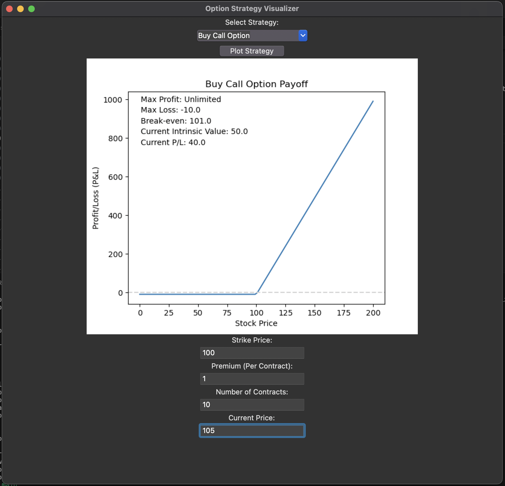

# Option-Visualizer

Option-Visualizer is a Python-based tool designed to help you visualize the payoff of different option strategies.

## Features

### Supported Strategies
The repository provides classes to represent different option strategies. Currently, it supports:

- Buying & Selling Call Options
- Buying & Selling Put Option

Each strategy class comes with methods to calculate the payoff, maximum profit, maximum loss, and break-even point.

### Visualization
The `visualize.py` script offers a user-friendly GUI that allows you to:

1. Select a strategy
2. Input parameters such as strike price and premium paid
3. Visualize the strategy's payoff using matplotlib.

## Usage

To get started, follow these steps:

1. Clone the repository.
2. Install the required libraries.
3. Run the `visualize.py` script.
4. Use the GUI to select a strategy, input the required parameters, and visualize the payoff.

Enjoy exploring and visualizing different option strategies with Option-Visualizer!

# Example output

